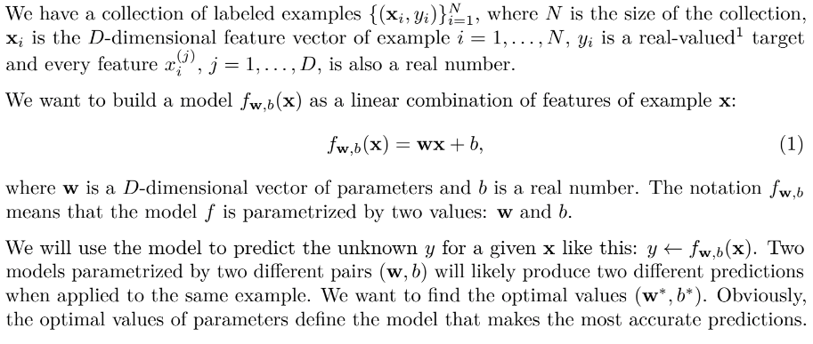

## Problem Statement ##

Apart from the 'sign' operator, the equation of the model for Linear Regression is similar to that of SVM's model equation.

The two models are indeed similar. However, the hyperplane in the SVM plays the role of the decision boundary: it’s used to separate two groups of examples from one another. On the other hand, the hyperplane in linear regression is chosen to be as close to all training examples as possible.

[Implementing Linear Regression from scratch in Python](https://github.com/manaschaturvedi/linear_regression_implementation)