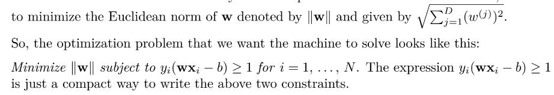

## Support Vector Machines (SVM) ##
Compared to Logistic Regression and Neural Networks, SVMs sometimes perform better for complex,
non-linear functions.

An example to understand this algorithm:

Let's take an example of the Email Spam Classification problem where the goal is to build a model
using SVM algorithm to classify an email into a spam or a non-spam mail. The training set consists
of 10,000 email messages, each labelled as either 'Spam' or 'Non-spam'. 

The first step now is to convert each email message in the training set into numbers that the algorithm can understand. This can be done using this approach:

We will also convert each label into either 1 (spam) or -1 (non-spam).

In geometry, a hyperplane is a subspace whose dimension is one less than that of its ambient space. If a space is 3-dimensional then its hyperplanes are the 2-dimensional planes, while if the space is 2-dimensional, its hyperplanes are the 1-dimensional lines. 

We would also prefer that the hyperplane separates positive examples from negative ones with the largest margin. The margin is the distance between the closest examples of two classes, as defined by the decision boundary. A large margin contributes to a better generalization, that is how well the model will classify new examples in the future. Hence, SVM is also known as a 'large margin' or 'discriminative' classifier.

SVM finds an optimal hyperplane which helps in classifying new data points.

The constraint that we aim to satisfy in SVM is this:

For two-dimensional feature vectors, the problem and the solution can be visualized as:

The blue and orange circles represent, respectively, positive and negative examples, and the line given by wx−b=0 is the decision boundary.

In order for the SVM to come up with a decision boundary with the largest margin, we need

Why, by minimizing the norm of w, do we find the highest margin between the two classes? Geometrically, the equations wx−b=1and wx−b=−1 define two parallel hyperplanes, as you seen in the image above. The distance between these hyperplanes is given by 2/||w||, so the smaller the norm ||w||, the larger the distance between these two hyperplanes. That’s how Support Vector Machines work.

## SVM Kernels ##

This particular version of the algorithm builds the so-called linear model. It’s called linear because the decision boundary is a straight line (or a plane, or a hyperplane). 

However, SVMs don't perform well when we require a non-linear decision boundary to separate our training set. In some cases, it could be impossible to perfectly separate the two groups of points because of noise in the data, errors of labeling, or outliers. In such cases, we can use 'kernels'. A kernel is basically a function that maps the data to a higher dimension where the data is separable.

Popular kernel functions:
- Gaussian
- Polynomial

SVMs are thus powerful in the sense that they can also generate non-linear decision boundaries.

The SVM algorithm is implemented in practice using a kernel. SVM uses a technique called the kernel trick. Here, the kernel takes a low-dimensional input space and transforms it into a higher dimensional space. Kernel trick helps you to build a more accurate classifier.