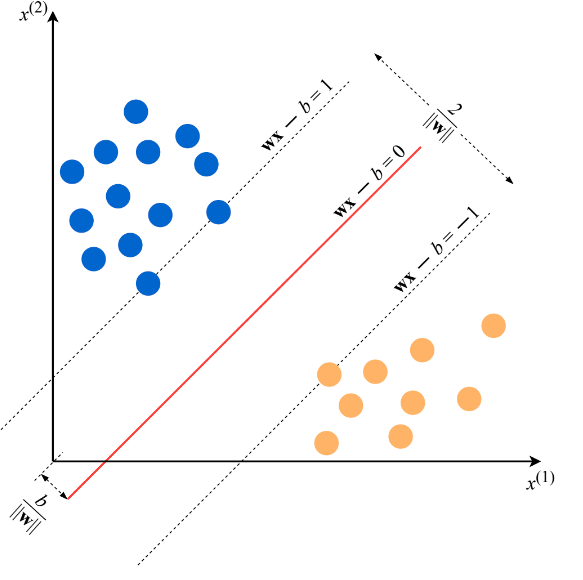

## Support Vector Machines (SVM) ##
Compared to Logistic Regression and Neural Networks, SVMs sometimes perform better for complex,
non-linear functions.

An example to understand this algorithm:

Let's take an example of the Email Spam Classification problem where the goal is to build a model
using SVM algorithm to classify an email into a spam or a non-spam mail. The training set consists
of 10,000 email messages, each labelled as either 'Spam' or 'Non-spam'. 

The first step now is to convert each email message in the training set into numbers that the algorithm can understand. This can be done using this approach:

We will also convert each label into either 1 (spam) or -1 (non-spam).

In geometry, a hyperplane is a subspace whose dimension is one less than that of its ambient space. If a space is 3-dimensional then its hyperplanes are the 2-dimensional planes, while if the space is 2-dimensional, its hyperplanes are the 1-dimensional lines. 

We would also prefer that the hyperplane separates positive examples from negative ones with the largest margin. The margin is the distance between the closest examples of two classes, as defined by the decision boundary. A large margin contributes to a better generalization, that is how well the model will classify new examples in the future. Hence, SVM is also known as a 'large margin classifier'.

The constraint that we aim to satisfy in SVM is this:

For two-dimensional feature vectors, the problem and the solution can be visualized as:

The blue and orange circles represent, respectively, positive and negative examples, and the line given by wx−b=0 is the decision boundary.