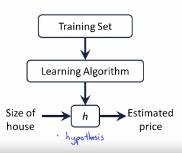

## Types of Machine Learning ##
Machine Learning can be classified into:
- Supervised
- Semi-supervised
- Unsupervised
- Reinforcement

## Supervised Learning ##
In supervised learning, the dataset is the collection of labeled examples { ( x  i  , y  i  ) }  N   i = 1 . Each element x i among N is called a feature vector. A feature vector is a vector in which each dimension j = 1, . . . , D contains a value that describes the example somehow. That value is called a feature and is denoted as x (j). 

For instance, if each example x in our collection represents a person, then the first feature, x (1) , could contain height in cm, the second feature, x (2) , could contain weight in kg, x (3) could contain gender, and so on.

The label y i can be either an element belonging to a finite set of classes {1,2, . . . , C}, or a real number, or a more complex structure, like a vector, a matrix, a tree, or a graph.

The goal of a supervised learning algorithm is to use the dataset to produce a model that takes a feature vector x as input and outputs information that allows deducing the label for this feature vector.

## Unsupervised Learning ##
In unsupervised learning, the dataset is a collection of unlabeled examples { x i } N i=1. Again, x is a feature vector, and the goal of an unsupervised learning algorithm is to create a model that takes a feature vector x as input and either transforms it into another vector or into a value that can be used to solve a practical problem. For example, in clustering, the model returns the id of the cluster for each feature vector in the dataset. In dimensionality reduction, the output of the model is a feature vector that has fewer features than the input x; in outlier detection, the output is a real number that indicates how x is different from a “typical” example in the dataset.

## Semi-supervised Learning ##
In semi-supervised learning, the dataset contains both labeled and unlabeled examples. Usually, the quantity of unlabeled examples is much higher than the number of labeled examples. The hope here is that using many unlabeled examples can help the learning algorithm to find (we might say “produce” or “compute”) a better model.

## Reinforcement Learning ##
Reinforcement learning is a subfield of machine learning where the machine “lives” in an environment and is capable of perceiving the state of that environment as a vector of features. The machine can execute actions in every state. Different actions bring different rewards and could also move the machine to another state of the environment. The goal of a reinforcement learning algorithm is to learn a policy. A policy is a function (similar to the model in supervised learning) that takes the feature vector of a state as input and outputs an optimal action to execute in that state. The action is optimal if it maximizes the expected average reward. Reinforcement learning solves a particular kind of problem where decision making is sequential, and the goal is long-term, such as game playing, robotics, resource management, or logistics.